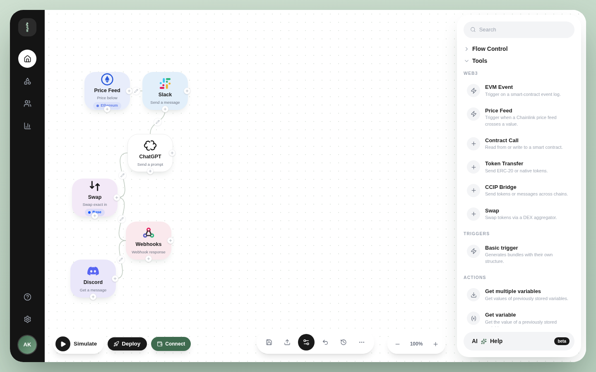

# Stringz

**Visual, no-code Web3 automation builder - "n8n for Web3".**
Drag nodes onto a canvas: Chainlink price feeds, EVM events, contract calls, swaps, CCIP - mixed with web2 apps like Slack, Discord, Telegram, Google Sheets, Notion, and ChatGPT. Stringz compiles the canvas into a [Chainlink CRE](https://docs.chain.link/cre) workflow project you run and deploy under your own keys.

> **Stringz is tooling only.** We never hold your keys, funds, or signatures, and we never ask for a private key or seed phrase - the same way n8n or Zapier never touch your credentials. Generated workflows run under *your* Chainlink CRE account with *your* secrets.



## Quickstart

```bash
bun install
cp .env.example .env   # optional: WalletConnect id, OAuth keys (see .env.example)
bun run dev:all        # web on :3000 + api on :8787 (Postgres; DATABASE_URL in .env)
```

- `/` - marketing site, `/waitlist`, `/auth`, `/privacy`, `/terms`
- `/app` - the builder (lazy-loaded; pulls in the wallet stack only on this route)

Production build: `bun run build`, preview with `bun run preview`.

## How it works

```
canvas nodes + edges
  -> Blueprint JSON IR (flowkit.blueprint/v1, src/compiler/schema.ts)
  -> Chainlink CRE project zip (src/compiler/cre.ts)
  -> cre workflow simulate   (locally, no approval needed)
  -> cre workflow deploy     (to a Chainlink DON, after access approval)
```

- The Blueprint IR validates the graph (trigger count, detached nodes, module support, required per-node config) before anything is emitted.
- Price-feed, wallet-balance, and gas-price nodes read live on-chain data through public RPC endpoints (no API keys; viem fallback transport): Chainlink feed pairs, native balances via Multicall3, and the mainnet Fast Gas feed. Addresses are verified by on-chain reads; unsupported combinations render disabled in the UI rather than guessing an address.
- Runs are live: pressing Run or Test reads real chain data first (with a sample fallback) and resolves `{{nodeId.field}}` expressions against actual outputs, n8n-style.
- Web2 modules (Slack, Discord, ChatGPT, ...) compile to real HTTP calls whose endpoints come from your own `secrets.yaml` / `.env` - Stringz never sees them. Each can retry on failure and either stop or continue the flow.
- Flow-control nodes (condition gates), text parsing, Google Sheets rows, generic HTTP requests, and Telegram alerts compile to dedicated CRE steps, not generic webhooks.
- DON deployment is approval-gated by Chainlink; Stringz redirects you to their access flow rather than gating anything in-app.

## Run an exported flow locally

In the builder: configure a few nodes, press **Export** (Blueprint JSON) or open **Deploy -> Export CRE project** for the runnable `flow.zip`. Then:

```bash
unzip <flow-name>.zip
cp .env.example .env       # add your CRE_ETH_PRIVATE_KEY + any app secrets (names only in the app)
cd <flow-name>-workflow && bun install
cd .. && cre workflow simulate <flow-name>-workflow --target staging-settings
```

Local simulation is self-serve - no Chainlink approval needed. Deploying to a DON
requires access your organization requests itself: run `cre account access`
(checks status, submits the request with a short use-case description; Chainlink
reviews by email - `cre whoami` shows the status). Once approved:
`cre workflow deploy <flow>-workflow --target production-settings`.
Details: https://docs.chain.link/cre/account/deploy-access

## Headless browser check

`scripts/browser-check.mjs` drives the app with Playwright (19 checks: landing
fonts, canvas node config sheets, drag-connect, export gate, auth, save/load,
mobile screenshots). Needs `bun run dev:all` plus `bun add -d playwright` and
`bunx playwright install chromium` once.

## Backend

`server/` is a Bun + Hono + tRPC + Drizzle API (Postgres via `DATABASE_URL` -
the self-hosting-friendly choice).
It serves accounts (email + password by default; GitHub OAuth and wallet
sign-in via env), saved flows, cloud-simulation orchestration, the billing
proxy, and the operator admin dashboard. The web app talks to it through
same-origin `/trpc` (dev proxy in `vite.config.ts`). The API contract
(`src/lib/contract.ts`) is shared zod schemas, so shape drift fails typecheck.

```bash
bun run server      # api only (:8787)
bun run dev:all     # api + web
```

## Self-hosting

The builder is open source (Apache-2.0) and runs fully on your own
infrastructure:

```bash
docker compose -f compose.yaml up -d postgres
cp .env.example .env   # DATABASE_URL matches the compose defaults; add OAuth ids if you want them
bun install && bun run dev:all
```

Migrations apply automatically at boot. What degrades by design without our
hosted services:

- **Without the stringz-pay rail** (`STRINGZ_PAY_URL` unset): the app runs
  in community mode - entitlements fall back to local plan columns and the
  checkout sheet answers with a clear error instead of charging. Nothing
  else is gated.
- **Without the GCP simulation fleet** (`SIM_*` unset): the canvas still
  compiles and exports; run simulations locally with the exported project
  (`cre workflow simulate`), which needs no approval.
- Pro features on a self-hosted instance are the same code as Pro in our
  cloud - what the hosted Pro tier pays for is the operated simulation
  fleet, not extra source code.

## Stack

React 19 + TypeScript + Vite 7 + Tailwind 3.4 + shadcn/ui, wagmi 2 + RainbowKit + viem, Bun (package manager + runtime).

## WalletConnect project id

The app runs with a public demo project id unless you set your own:

1. Create a project at [cloud.walletconnect.com](https://cloud.walletconnect.com)
2. Put it in `.env` as `VITE_WC_PROJECT_ID=...`

The id ships inside the browser bundle, so treat it as public - never put anything secret in `.env`.

## Contributing

See [CONTRIBUTING.md](CONTRIBUTING.md). TL;DR: `bun install`, `bun run build` must pass, keep the "tooling only" constraint intact in any copy or generated code.

## License

[Apache-2.0](LICENSE) - Copyright (c) 2026 Sylus Abel
